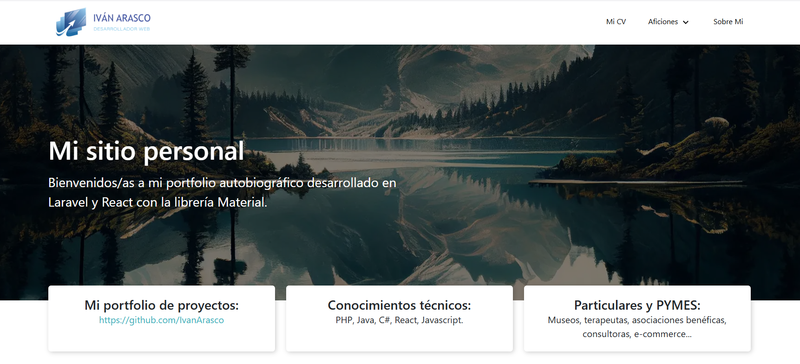
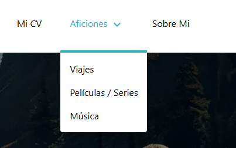
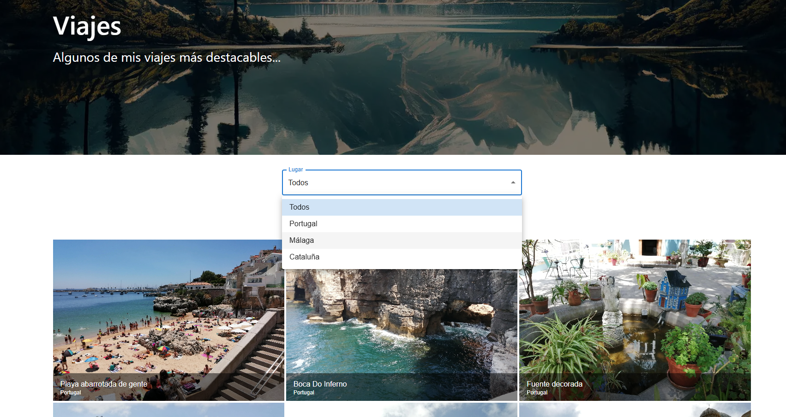
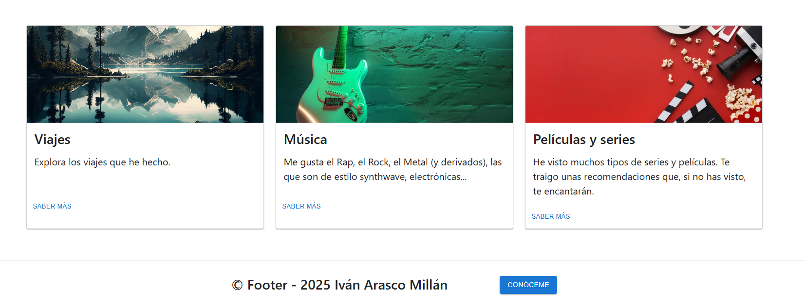

# Proyecto Autobiográfico
Proyecto realizado con Laravel y React apoyándome de la librería MaterialUI (en desarrollo).
- El objetivo es crear la web con componentes de Material (customizados y adaptados) y propios con React.
- Refleja mis aficiones (viajes, películas/series...), un enlace a mi currículum y algo de información personal.
- En la pantalla de inicio se ve una 'preview' de algunos de los contenidos accesibles por la web, generados dinámicamente cada vez que el usuario refresque la página.
- Dado que la temática es mi perfil personal y profesional, el contenido puede ampliarse con más secciones que reflejen otros intereses, experiencias etc.

# Imágenes del proyecto

